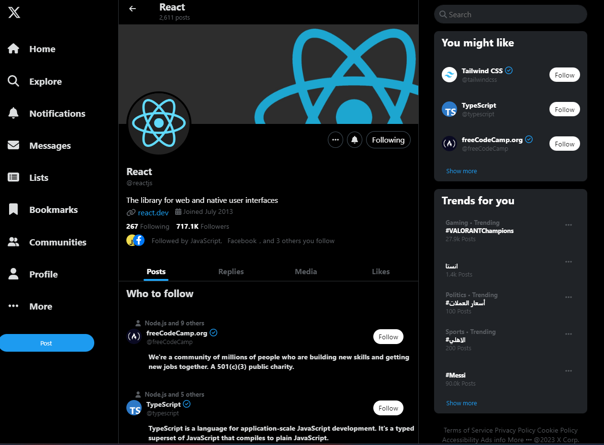

# React Social Media Dashboard

This is a simple React application that simulates a social media dashboard. It consists of various components that mimic
the layout and functionality of a social media platform. This project is intended to serve as an example of how to
structure a React application with reusable components and styles.

## Technologies Used

- React library for building user interfaces
- FontAwesome for icons
- CSS for styling

## Project Structure

The project is organized as follows:

- `index.js`: Entry point of the application which will render the `App` component.
- `App.js`: The main component of the application which will render the all the components.
- `Main.js`: The main area of the application that contains the page information and tweets.
- `Dashboard.js`: The navigation dashboard component.
- `Recommendations.js`: The recommendations component and trending topics.
- `stylesheets/`: Contains CSS files for styling components.

## How to Run

1. Clone the repository.

    ``` bash
    git clone https://github.com/Mohammad-AbuJaber/React-Profile-on-Twitter.git
    ```

2. Navigate to the project directory.
    ``` bash
    cd React-Profile-on-Twitter
    ```
3. Install dependencies with `npm install`.
4. Start the development server with `npm start`.

You can also view the live demo [here](https://mohammad-abujaber.github.io/React-Profile-on-Twitter/).

## Screenshot



## License

This project is licensed under the MIT License. See the [LICENSE](LICENSE) file for details.
